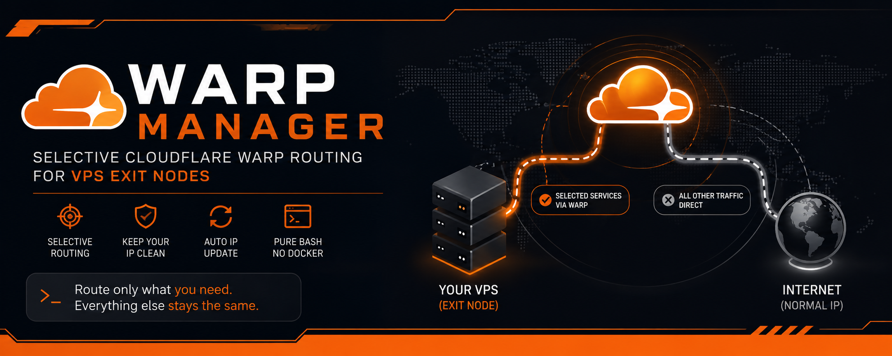

<p align="center">
  
</p>

# WARP Manager

**Selective Cloudflare WARP routing for a VPS exit node.**
TeleGram: **@BlackProtocols**

Only the services *you* pick (Gemini, ChatGPT, Netflix, ...) go through Cloudflare
WARP. All other traffic keeps your server's normal IP. **Pure Bash, no Docker, and
it never touches your tunnel / Xray / panel config.**

---

## One-command install

On the VPS (Ubuntu/Debian), as root:

```bash
sudo bash -c "$(curl -fsSL https://raw.githubusercontent.com/AminMGMT/WARP-Manager/main/setup.sh)"
```

That's it — it downloads everything, installs, and opens the menu automatically.

Or clone and run manually:

```bash
git clone https://github.com/AminMGMT/WARP-Manager.git
cd WARP-Manager
sudo bash install.sh
```

The installer shows a progress bar per step and opens the menu when done:

```
Installing Dependencies    [################################] 100%
Copying Files              [################################] 100%
Preparing WARP             [################################] 100%
Generating Profile         [################################] 100%

  WARP is Ready : sudo wm
```

By default the **AI** group is enabled so Gemini/ChatGPT work right away.

---

## The problem it solves

Tunnel: user in Iran → foreign VPS (e.g. Germany) → internet.
The VPS IP is blocked and some sites (like Gemini) won't open on it.
Fix: send just those sites through Cloudflare WARP, leave everything else alone.

---

## How it works

```
        User (Iran)
            │  (your tunnel — untouched)
            ▼
   ┌──────────────────────────── VPS ──────────────────────────────┐
   │  Tunnel / panel  ──►  outbound (OUTPUT) to the internet        │
   │                              │                                  │
   │        nftables: if destination ∈ selected ranges → mark 51888  │
   │                              │                                  │
   │            ┌─────────────────┴─────────────────┐                │
   │        mark=51888                          no mark              │
   │            ▼                                    ▼                │
   │   WARP (WireGuard)                       direct via eth0         │
   │   → clean Cloudflare IP                  → normal server IP      │
   └────────────────────────────────────────────────────────────────┘
```

- WARP comes up as a WireGuard interface in **non-global** mode: only packets
  carrying `fwmark 51888` exit through WARP (policy routing + a dedicated table).
- One `nftables` table (`warp`) holds two sets (v4/v6). Any packet whose destination
  is in a set gets `fwmark 51888`. The WARP endpoint + private ranges are kept in an
  exclusion set so a routing loop can never form.
- The sets are filled by resolving the selected services' domains/ranges.
- A systemd timer refreshes the sets every N minutes.

Because routing is decided by **destination IP at the OS level**, there is nothing to
configure in your tunnel, and it never even notices.

---

## Usage

```bash
sudo wm          # or: sudo warp-manager
```

Menu:

```
 1. Choose Services
 2. Custom Domains
 3. Refresh Routes
 4. Manage
 5. Uninstall
 6. Exit
```

- **1) Choose Services** — toggle whole groups on/off:
  - **AI** [ Gemini & Google AI, ChatGPT, Grok, Perplexity, Copilot ]
  - **Music** [ SoundCloud, Spotify, Apple Music, Tidal ]
  - **Social Media** [ X, SnapChat, Reddit ]
  - **Stream** [ Netflix, Twitch, Kick ]

  On apply, each service shows `Done` (green) or `Failed` (red); a failed service is
  skipped and the rest continue.
- **2) Custom Domains** — add/remove any other domain.
- **3) Refresh Routes** — refresh all sets now.
- **4) Manage** — Auto-Update interval · Change IP · WARP+ License · Status · Restart.
- **5) Uninstall** — completely removes everything.

### Non-interactive commands

```bash
sudo warp-manager --refresh      # refresh the sets
sudo warp-manager --up           # bring WARP up + apply routes
sudo warp-manager --down         # stop WARP
sudo warp-manager --change-ip    # get a new WARP IP
sudo warp-manager --license KEY  # apply a WARP+ license
warp-manager --location          # show WARP location
warp-manager --status            # short status summary
sudo warp-manager --purge        # remove everything
```

---

## Groups & services

Groups live in `data/groups.conf`; each service is a file in `data/providers/<id>.conf`.

| Group        | Services                                               |
|--------------|--------------------------------------------------------|
| AI           | Gemini & Google AI, ChatGPT, Grok, Perplexity, Copilot |
| Music        | SoundCloud, Spotify, Apple Music, Tidal                |
| Social Media | X, SnapChat, Reddit                                    |
| Stream       | Netflix, Twitch, Kick                                  |

Add your own: drop a `data/providers/<id>.conf` and reference it in `data/groups.conf`.
Provider types: `domain` (a domain list), `geosite` (a category), or `cidr` (a CIDR list URL).

---

## WARP+ license

Have a WARP+ key? Menu → **Manage → WARP+ License → set**. It's applied to the
account and preserved when you change IP.

---

## End-to-end test

After installing, verify everything works:

```bash
sudo bash test/e2e.sh
```

It checks the interface, sets, policy rules, that the WARP exit IP differs from the
server IP, that marked traffic routes via WARP while unmarked traffic stays direct,
and that Gemini is selected and reachable through WARP. Read-only and safe.

---

## Notes

- Your tunnel must connect to the real destination IP (default behavior). Routing is
  by destination IP, so it doesn't matter where DNS was resolved.
- After a reboot, the tunnel and WARP come up automatically and the timer rebuilds the
  rules within ~45 seconds.

---

## Uninstall

```bash
sudo bash uninstall.sh
# or from the menu: option 5
```

Removes the WARP interface, WARP account, all rules, config, systemd units, and every
warp-manager file.

---

## Acknowledgements

WARP account registration uses [wgcf](https://github.com/ViRb3/wgcf). Thanks!

## Support

If WARP Manager helps you, a star or a small tip is appreciated. 🙏

Telegram channel: **@BlackProtocols**

| Coin | Address |
|------|---------|
| Tron (TRX) | `TTzuUAtsEsrLgNpFVLNTyLVJVRRFNWESYc` |
| USDT (BEP20) | `0xc112AE9bfF7c59dEcFb34E988A397848D3093E82` |
| Toncoin (TON) | `UQD9g40QubAICJ6zPqegtCY7s-joMx2DB8aIqA0xF1aHoCDs` |

## License

Copyright © 2026 Amin Mohammadi (AminMGMT). Released under the MIT License — see [LICENSE](LICENSE) and [NOTICE](NOTICE).
