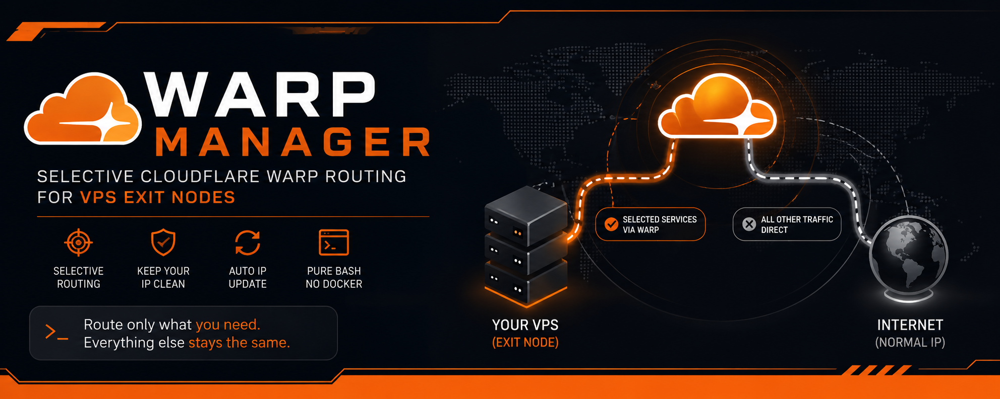

<p align="center">
  
</p>

# WARP Manager

**Selective Cloudflare WARP routing for Linux VPSs.**

<p align="center">

Route only the services you choose through Cloudflare WARP while everything else continues using your server's public IP.

No Docker • Pure Bash • Zero changes to your tunnel or proxy configuration

</p>

Telegram: **@BlackProtocols**

---

## Features

- Route only selected services through Cloudflare WARP
- Keep all other traffic on the server's native IP
- Domain-based routing using **TLS SNI** and **QUIC ClientHello**
- 100+ built-in providers across multiple categories
- Custom domains
- Global ad blocker (AdGuard DNS Filter + sing-box rules)
- Automatic WARP IP health monitoring
- Automatic route refresh and scheduled restart
- WARP+ license support
- Import / Export presets
- Interactive CLI
- Fail-open protection
- HTTP/3 (QUIC) support
- Pure Bash
- No Docker
- No changes to Xray, Marzban, Hiddify, OpenVPN, WireGuard or your existing tunnel

---

## Installation

### One-command install

Ubuntu / Debian

```bash
sudo bash -c "$(curl -fsSL https://raw.githubusercontent.com/AminMGMT/WARP-Manager/main/setup.sh)"
```

The installer downloads everything, prepares WARP, installs all required components and opens the interactive menu automatically.

Or install manually:

```bash
git clone https://github.com/AminMGMT/WARP-Manager.git
cd WARP-Manager
sudo bash install.sh
```

Installation progress:

```text
Installing Dependencies    [################################] 100%
Copying Files              [################################] 100%
Preparing WARP             [################################] 100%
Generating Profile         [################################] 100%

WARP is Ready → sudo wm
```

After installation a small AI preset is enabled automatically, allowing services such as ChatGPT, Gemini, Claude, Copilot, Grok and Perplexity to work immediately. Everything else can be enabled from the menu with a few keystrokes.

---

## The Problem

Many VPS providers are unable to access certain services such as **Gemini**, while others may be rate-limited or geo-restricted. Sending all traffic through Cloudflare WARP solves this, but it also changes the server's exit IP for everything, which is often undesirable.

WARP Manager solves this by routing **only the services you choose** through Cloudflare WARP while every other connection continues to use the VPS's normal public IP.

Your existing tunnel, proxy and panel remain completely untouched.

---

## Architecture

```
                              Client
                                 │
                        (Tunnel / VPN / Proxy)
                                 │
                                 ▼
┌────────────────────────────── VPS ──────────────────────────────┐
│                                                                 │
│               Outbound TCP 80/443 + UDP 443                     │
│                            │                                    │
│                            ▼                                    │
│                    nftables TPROXY                              │
│                            │                                    │
│                            ▼                                    │
│                      sing-box Engine                            │
│                (TLS SNI + QUIC Inspection)                      │
│                            │                                    │
│              ┌─────────────┴─────────────┐                      │
│              │                           │                      │
│       Selected Services           Everything Else              │
│              │                           │                      │
│              ▼                           ▼                      │
│      Cloudflare WARP              Native Server IP             │
│                                                                 │
└─────────────────────────────────────────────────────────────────┘
```

---

## How It Works

WARP Manager intercepts only the VPS's outbound HTTPS traffic using **nftables TPROXY** and forwards it to **sing-box** running locally.

Instead of routing by IP address, sing-box inspects the real destination domain from the TLS **Server Name Indication (SNI)** and **QUIC ClientHello**. This makes routing reliable even for modern applications that frequently change IP addresses or use CDNs.

When a connection matches one of the selected providers, it is forwarded through the Cloudflare WARP WireGuard interface. Every other connection bypasses WARP and leaves through the VPS's normal network interface.

Because routing is based on domains rather than destination IPs, applications continue to work correctly even when their backend infrastructure changes.

### Traffic Flow

```
Application
     │
     ▼
Is the destination selected?
     │
 ┌───┴──────────────┐
 │                  │
 ▼                  ▼
Yes                No
 │                  │
 ▼                  ▼
Cloudflare WARP   Direct Internet
```

---

## Design Goals

- Route only the traffic that actually needs WARP.
- Leave existing tunnels, proxies and panels untouched.
- No Docker containers.
- No DNS hijacking.
- No public listening ports.
- Fully automatic installation.
- Safe fail-open behavior if the routing engine becomes unavailable.
- Support both HTTP/2 and HTTP/3 (QUIC).
- Keep the configuration simple enough to migrate between servers.

---

## The Problem

Many VPS providers are unable to access certain services such as **Gemini**, while others may be rate-limited or geo-restricted. Sending all traffic through Cloudflare WARP solves this, but it also changes the server's exit IP for everything, which is often undesirable.

WARP Manager solves this by routing **only the services you choose** through Cloudflare WARP while every other connection continues to use the VPS's normal public IP.

Your existing tunnel, proxy and panel remain completely untouched.

---

## Architecture

```
                              Client
                                 │
                        (Tunnel / VPN / Proxy)
                                 │
                                 ▼
┌────────────────────────────── VPS ──────────────────────────────┐
│                                                                 │
│               Outbound TCP 80/443 + UDP 443                     │
│                            │                                    │
│                            ▼                                    │
│                    nftables TPROXY                              │
│                            │                                    │
│                            ▼                                    │
│                      sing-box Engine                            │
│                (TLS SNI + QUIC Inspection)                      │
│                            │                                    │
│              ┌─────────────┴─────────────┐                      │
│              │                           │                      │
│       Selected Services           Everything Else              │
│              │                           │                      │
│              ▼                           ▼                      │
│      Cloudflare WARP              Native Server IP             │
│                                                                 │
└─────────────────────────────────────────────────────────────────┘
```

---

## How It Works

WARP Manager intercepts only the VPS's outbound HTTPS traffic using **nftables TPROXY** and forwards it to **sing-box** running locally.

Instead of routing by IP address, sing-box inspects the real destination domain from the TLS **Server Name Indication (SNI)** and **QUIC ClientHello**. This makes routing reliable even for modern applications that frequently change IP addresses or use CDNs.

When a connection matches one of the selected providers, it is forwarded through the Cloudflare WARP WireGuard interface. Every other connection bypasses WARP and leaves through the VPS's normal network interface.

Because routing is based on domains rather than destination IPs, applications continue to work correctly even when their backend infrastructure changes.

### Traffic Flow

```
Application
     │
     ▼
Is the destination selected?
     │
 ┌───┴──────────────┐
 │                  │
 ▼                  ▼
Yes                No
 │                  │
 ▼                  ▼
Cloudflare WARP   Direct Internet
```

---

## Design Goals

- Route only the traffic that actually needs WARP.
- Leave existing tunnels, proxies and panels untouched.
- No Docker containers.
- No DNS hijacking.
- No public listening ports.
- Fully automatic installation.
- Safe fail-open behavior if the routing engine becomes unavailable.
- Support both HTTP/2 and HTTP/3 (QUIC).
- Keep the configuration simple enough to migrate between servers.

---

## Usage

Start WARP Manager:

```bash
sudo wm
# or
sudo warp-manager
```

Main menu:

```text
1. WARP ● ON
    1. Choose Services
    2. Custom Domains
    3. White Lists
    4. Connection
        1. Change IP
        2. Auto IP Health
        3. QUIC Handling
    5. Automation
        1. Auto Restart
        2. Refresh Routes
    6. Presets
        1. Export Preset
        2. Import Preset
        3. Import WARP Account
    7. WARP+ License
    8. Status
    9. Restart WARP

2. Ad Blocker ○ OFF

3. Restart All Services

4. Update

5. Uninstall

6. Exit
```

---

## Menu Overview

### WARP

All WARP-related features are grouped under a single menu.

### Choose Services

Select which services should use Cloudflare WARP.

Over **100 providers** are available across multiple categories, including AI, Streaming, Social Media, Gaming, Developer Tools and more.

Example:

```text
Choose Services      21 of 105 selected

1. ◐ AI
2. ○ Music
3. ○ Social Media
4. ○ Messaging
5. ○ Streaming
...

a  Select All
n  Select None
i  Invert Selection
0  Apply & Back
```

Supported input formats:

```
3
1 5 9
2-7
```

Categories containing a single provider (such as **All Google Services**) toggle immediately without opening a submenu.

---

### Custom Domains

Add any domain that is not included in the built-in provider database.

Example:

```
example.com
api.example.com
```

---

### White Lists

Domains that should never be blocked by the Ad Blocker.

Useful when a website or application requires a tracking or analytics domain to function correctly.

---

### Connection

Manage the WARP tunnel itself.

- Change WARP IP
- Automatic IP Health Monitoring
- QUIC (HTTP/3) Handling

---

### Automation

Automate common maintenance tasks.

- Scheduled WARP restart
- Route refresh

These features help keep long-running servers healthy without manual intervention.

---

### Presets

Move your entire configuration between servers.

A preset includes:

- Selected services
- Custom domains
- White list
- Ad Blocker settings
- QUIC mode
- Auto Restart
- Auto IP Health
- Optional WARP+ license

Export a preset on one server and import it on another to recreate the same configuration within seconds.

---

### WARP+ License

Apply or replace your Cloudflare WARP+ license.

The license is preserved when changing WARP IPs.

---

### Status

Display the current system status, including:

- WARP state
- WARP IP
- Location
- Selected services
- Engine status
- Ad Blocker status

---

### Restart WARP

Restarts only the WARP interface and rebuilds the routing engine.

---

### Ad Blocker

Blocks ads and trackers using:

- AdGuard DNS Filter
- sing-box built-in rule sets

Runs locally with no DNS server and no additional services.

---

### Restart All Services

Restarts every WARP Manager component, including:

- WARP
- sing-box
- nftables rules
- Background timers

---

### Update

Downloads and installs the latest version while preserving your existing configuration.

---

### Uninstall

Completely removes WARP Manager, WARP, configuration files and system services.

---

## Built-in Providers

WARP Manager includes more than **100 predefined services** organized into practical categories.

Simply select the services you want from the interactive menu — no manual routing rules are required.

| Category | Providers |
|----------|-----------|
| 🤖 AI | ChatGPT, Gemini, Claude, Cursor, Copilot, Grok, Perplexity, Midjourney, ElevenLabs, Runway, Suno, Udio, Windsurf and more |
| 🎵 Music | Spotify, Apple Music, YouTube Music, SoundCloud, Tidal, Deezer, Bandcamp, Amazon Music and more |
| 🌐 Social Media | X, Instagram, Threads, TikTok, Facebook, Reddit, Pinterest, Bluesky and more |
| 💬 Messaging | Telegram, Discord, WhatsApp, Signal, LINE, WeChat |
| 🎬 Streaming | Netflix, Disney+, HBO Max, Apple TV+, Amazon Prime Video, Twitch, Kick and more |
| 💻 Developer | GitHub, GitLab, Docker Hub, Hugging Face, npm, PyPI, Railway, Render, Vercel and more |
| 🎮 Gaming | Steam, Epic Games, Riot Games, Battle.net, Xbox, PlayStation Network and more |
| ☁️ Cloud | AWS, Cloudflare, Azure, DigitalOcean, Google Cloud |
| 📈 Productivity | Notion, Slack, Zoom, Figma, Canva, Linear, Airtable, Miro |
| 💳 Payment | PayPal, Stripe, Wise, Revolut |
| 🟢 Google | All Google services (except YouTube) |
| 🔵 Microsoft | All Microsoft services |
| 🟣 Adobe | All Adobe services |

---

### Duplicate Providers

Some providers appear in more than one category.

For example:

- WhatsApp
- WeChat

are listed under both **Messaging** and **Social Media**.

Changing either entry updates the same underlying rule.

---

### Custom Providers

Need a service that isn't included?

Simply add your own provider definition and it becomes available inside the menu.

Provider definitions are stored in:

```text
data/providers/
```

Categories are defined in:

```text
data/groups.conf
```

No source code changes are required.

---

## Technical Notes

### Domain-Based Routing

WARP Manager routes traffic by **domain**, not by IP address.

Domains are extracted directly from:

- TLS Server Name Indication (SNI)
- QUIC ClientHello (HTTP/3)

This allows applications to continue working even when their backend IP addresses or CDNs change.

---

### Tunnel Safety

WARP Manager never modifies your existing tunnel or proxy configuration.

It works entirely on the VPS by intercepting outbound HTTPS traffic before it leaves the server.

If the routing engine becomes unavailable, a fail-open watchdog automatically removes the redirect rules so traffic continues through the VPS's normal connection instead of breaking existing tunnels.

---

### Automatic Startup

After every reboot, WARP Manager automatically restores:

- WARP
- sing-box
- nftables redirect rules
- Scheduled background services

No manual intervention is required.

---

### Ad Blocker

The built-in Ad Blocker combines:

- AdGuard DNS Filter
- sing-box rule sets

The filter list is updated automatically every week.

Failed downloads never replace a previously working list.

---

### Auto IP Health

Auto IP Health periodically verifies that the current WARP exit is still usable.

A new WARP IP is requested only when:

- WARP is connected
- The VPS has normal Internet connectivity
- The current exit is unavailable or located in a blocked region

To avoid Cloudflare rate limits, IP rotations are automatically limited.

---

### Connectivity Checks

Connectivity-check domains used by operating systems remain routed directly.

This prevents Android, Windows, iOS and other clients from reporting false "No Internet" warnings.

---

### Updates

Updating WARP Manager preserves:

- Selected services
- Custom domains
- White lists
- WARP account
- WARP+ license
- Ad Blocker settings
- Automation settings

Simply run:

```bash
sudo warp-manager --update
```

or run the installer again.

---

### Cloudflare Rate Limits

Some VPS providers temporarily receive **HTTP 429** during WARP registration.

If this happens:

- wait a few minutes and restart WARP, or
- import an existing `wgcf-account.toml` from another server.

The installer completes successfully even when registration is temporarily rate-limited.

---

## Uninstall

```bash
sudo bash uninstall.sh

# or

sudo warp-manager --purge
```

Removes:

- WARP
- sing-box
- nftables rules
- Configuration
- WARP account
- Systemd services

---

## Acknowledgements

WARP account registration is powered by
[wgcf](https://github.com/ViRb3/wgcf).

Special thanks to its contributors.

---

## Support

If WARP Manager helps you, a star or a small tip is appreciated. 🙏

Telegram channel: **@BlackProtocols**

| Coin | Address |
|------|---------|
| Tron (TRX) | `TTzuUAtsEsrLgNpFVLNTyLVJVRRFNWESYc` |
| USDT (BEP20) | `0xc112AE9bfF7c59dEcFb34E988A397848D3093E82` |
| Toncoin (TON) | `UQD9g40QubAICJ6zPqegtCY7s-joMx2DB8aIqA0xF1aHoCDs` |

## License

Copyright © 2026 Amin Mohammadi (AminMGMT). Released under the MIT License — see [LICENSE](LICENSE) and [NOTICE](NOTICE).
